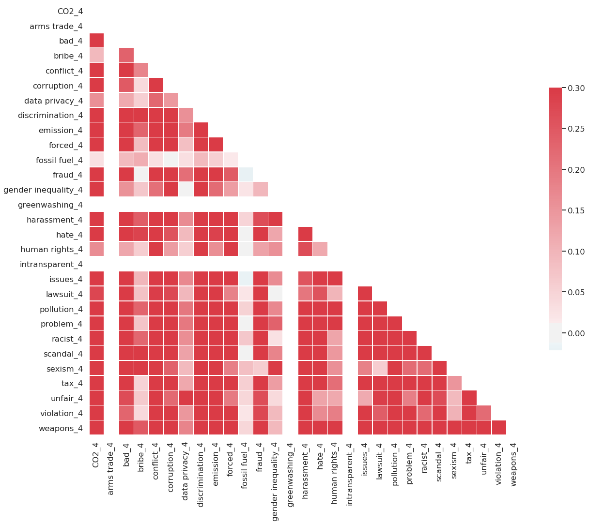
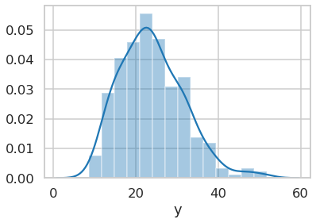
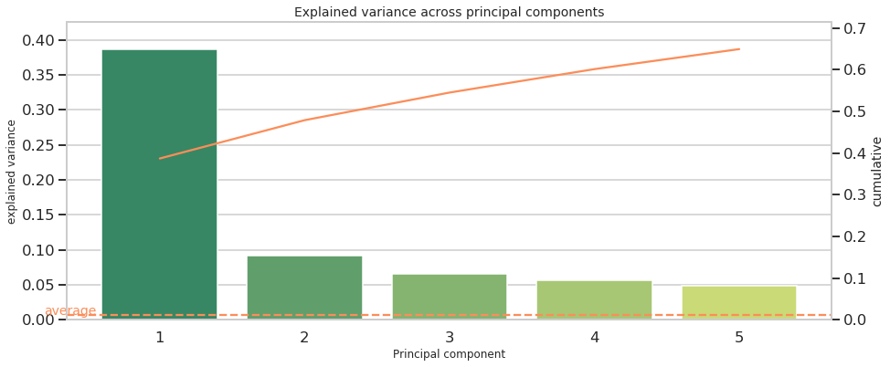
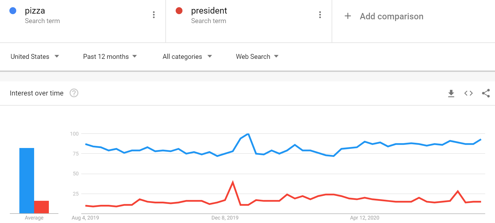
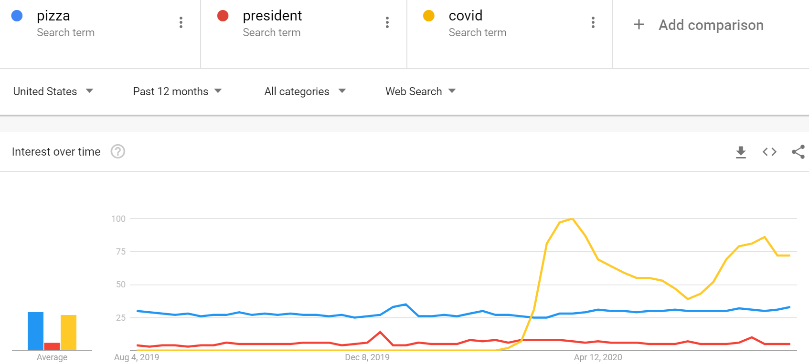
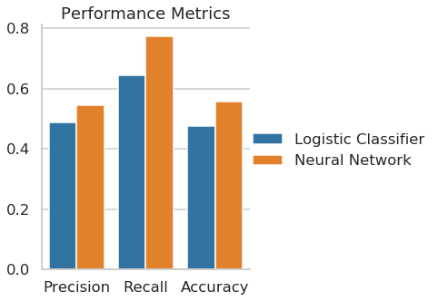

+++
title = "Predicting ESG risks with Pytorch, Google Trends and Amazon SageMaker"
tags = ["Amazon SageMaker",
    "PyTorch",
    "ESG", 
    "Finance",
    "model deployment", 
    "Google trends",
    "Yahoo finance", 
    "Pytrends", 
    "yahooquery"]
category = ["post"]
date = 2020-07-29
draft = true
+++


# Predicting ESG risks with Pytorch, Google Trends and Amazon SageMaker

## 0. README

I conducted this project as part of the Machine Learning Engineer Nanodegree at Udacity in August 2020. 

**Python libraries**	

It relies on the following libraries or services

* Python (3.6)
* Pytorch (1.4.0)
* Amazon Sagemaker
* Pytrends (4.7.3, https://pypi.org/project/pytrends/)
* Yahooquery (2.2.6, https://pypi.org/project/yahooquery/)

**Files**

There are several files 

Running `1_data_collection.ipynb` takes approximately 17 hours due to Google's rate limit and a timeout function which avoids server errors. It is therefore recommended to load the provided csv data files for replication. 


## I. Definition
<!-- _(approx. 1-2 pages)_ -->

### Project Overview
<!-- In this section, look to provide a high-level overview of the project in layman’s terms. Questions to ask yourself when writing this section:
- _Has an overview of the project been provided, such as the problem domain, project origin, and related datasets or input data?_
- _Has enough background information been given so that an uninformed reader would understand the problem domain and following problem statement?_ -->

The project deals with a prediction task within finance, and in particular, sustainable investment. Private investors increasingly demand firms that act socially responsible, environmentally friendly and have good governance. The UN and leading asset management firms developed the three pillars of ESG, namely environmental, social and governmental, in a conference in 2005 (International Finance Corporation et al., 2005). 

A few years ago investors were willing to accept lower returns for socially responsible investments, but firms with higher ESG scores closed the gap. Auer & Schuhmacher (2016) do not find lower returns of ESG investing compared to a market portfolio. This gives way to an increased demand by investors to invest according the ESG pillars and favor firms that score higher in ESG ratings. FTSE Russell (2018) finds that more than half of global asset owners are currently implementing or evaluating ESG considerations in their investment strategy.

ESG becomes increasingly relevant in today's investment decisions, especially in the face of global challenges such as climate change, human rights abuse or gender equality. That is why I want to find out more about ESG scores and how they can be predicted for firms using non-primary data from Google Trends.


#### Disclaimer

This project is meant to be a pilot for a more rigorous approach to ESG related metrics. I use it to make the error-prone interaction with Google trends accessible, establish work flows with Amazon Sagemaker and identify strengths and weaknesses of the self-collected data. The highly customized data is the major strength of this project. Once established processes to collect data can be easily extended and generalize to other problems, where custom data yields an advantage. 

But it also has its drawbacks regarding extensiveness, quality and high upfront costs. Collecting web data takes disproportionately more time than a ready-to-load dataset which leaves less time to work on equally important aspects, such as feature engineering, data processing, model selection, tuning and testing.  

All in all, the project yields amazing opportunities for follow-up work and great potential to generalize its data gathering process to other fields. This prototype holds valuable insights, especially for fields where data is scarce and customized solutions that rely on Google search data is crucial.

At the end of this report, I outline a road map for future work and possible extensions. These can be used to further carve out a data science portfolio and discover pathways to untapped data. 


### Problem Statement
<!-- * clearly define the problem that you are trying to solve, including the strategy (outline of tasks) you will use to achieve the desired solution.  -->

ESG investing requires individual investors to be disproportionately well informed. A lot of data about a firm has to be collected, processed and interpreted which leads to a high workload and cognitive strain. 

A fundamental problem lies in conflict of interest of the firm to not disclose anything which leads to bad press. Reports on sustainability, corporate social responsibility and even financial reports are often subject to manipulation at worst or overly positive framing at best. It is hard to distinguish between a company that is truly transparent and lives up to its self-defined sustainability principles or just pretends to act accordingly. To break this information asymmetry it often involves third parties, such as investigative journalism, whistle blowing or tight regulation.  

Overall ESG scores and ratings can be a starting point for ESG investing and provide a shortcut. Investors rely on different approaches to construct ESG compliant portfolios. One such approach excludes firms that fulfill negative criteria, such as being badly governed, involvement in scandals or even reliance on fossil fuels. 

Still, some investors want to be informed in detail, but their hunger for transparency is not met by the firm, which wants to hide and obscure scandals, visible in the media. A firm experiencing a scandal is salient to the public, why it likely appears more frequently in Google searches. Furthermore, providers of publicly available ESG ratings might not update their scores as frequently as professional paid services. Google trends can indicate short-term sentiment against a firm when negative criteria spike in search frequency.  

Another factor is about the complexity of ESG ratings. There is no standardized or regulated way to calculate ESG metrics, which leads to multiple methodologies to construct them. Each provider sells their methodology as superior, while details sometimes remain obscure. This is especially the case when sentiment analyses are included which involves intricate data collection, processing and modeling, which is too much to digest for an investor who tries to fully understand how they derive ESG metrics. In contrast to this, relying on Google searches is straightforward to understand and reduces complexity. 


Therefore, the project investigates the potential of using Google trends to infer ESG scores.  

It follows along the main question:	

---

**Can Google trends and machine learning inform investors about a firm's ESG performance?**

---

A more technical version of the problem statement could be: *Can machine learning models classify firms in their ESG performance based on Google search frequency?*

To find an answer, I implement a detailed implementation plan: 

#### Step-by-step implementation plan 

1.  Data collection
    1.  Get tickers from S&P 500 on Wikipedia 
    2.  Get main outcome: ESG risk, obtained through the yahooquery Pypi package (accessed with the parameter esg_scores for a ticker)
    3.  Obtain search metrics on ESG related keywords from Google trends through the pytrends Pypi package 

3.  Data processing and feature transformation
    1.  Collapse time dimension of Google trends search index into the following metrics for each keyword, using a defined time span, such as one year
        1.  Average search index across one year
        2. apply an exponential decay function as a weight, assigning higher weight to the most recent year 
        3. create binary classifier based on median split on ESG score, indicating high and low ESG performers
     2. Re-shape dataset into wide format, with columns as features and rows as firms 
    4. Split data into a train and test set, convert to .csv and upload to S3

5.  Descriptive statistics
    1.  List top-5 means of some variables
    2.  Correlation heatmap
    3.  inspect the outcome variables

7.  Training, validating and testing a model with Sagemaker
    1.  Write scripts for logistic regression benchmark: train.py
    2.  Write scripts for PyTorch neural network: model.py and train.py
    3.  Instantiate estimators with Sagemaker 
    4.  Run training job
    5.  Deploy models for testing

9.  Evaluation and benchmark comparison 
    1.  Key metrics for model performance: accuracy, precision and recall 
    2.  Possible model adjustment of the neural net when it lacks precision

11. Clean up resources
    1.  Delete endpoint
    2.  Remove other resources, such as emptying S3 bucket training jobs, endpoint configurations, notebook instances

**Potential results and hypotheses**

Before proceeding further with implementation details, I formulate potential project outcomes:  

1. ESG related keywords in Google trends are strong predictors of ESG scores and add informational value to ESG investors
2. Google trends data does not suffice to infer something about ESG performance
<!-- 3. (TODO: insert third hypothesis) -->


<!-- You should also thoroughly discuss what the intended solution will be for this problem. Questions to ask yourself when writing this section:
- _Is the problem statement clearly defined? Will the reader understand what you are expecting to solve?_
- _Have you thoroughly discussed how you will attempt to solve the problem?_
- _Is an anticipated solution clearly defined? Will the reader understand what results you are looking for?_
 -->

### Metrics
<!-- * clearly define the metrics or calculations you will use to measure performance of a model or result in your project.  -->

The prediction task is a classification since the outcome is binary (high/low ESG scores). This leads to the three basic metrics of precision, recall and accuracy. Other metrics that consider both precision and recall are area under the curve (ROC) and F-score. These are calculated based on the counts of four variables: True positives (TP),  true negatives (TN), false positives (FP) and false negatives (FN).


Accuracy is defined as 

$$accuracy = \frac{TP+TN}{N}$$ 	.

where $TP$ are true positives, $TN$ are true negatives, and $N$ is the count of non-missing entries.


#### Recap about accuracy, precision and recall

**Accuracy** measures how often a classifier predicts correctly. It’s the share of correct predictions to the total number of predictions.

**Precision** is the ratio of TP to all predicted to be positive (TP+FP).

**Recall** is the share of TP to all positives (TP+FN)


Classification problems with skewed label distributions lead to issues with accuracy which would not be an appropriate metric in that case. The reason are off-diagonal cases of the confusion matrix that are neglected in performance measurement. 

The outcome of interest, which is ESG high (1) or low performers (0) was constructed by a median split on firm ESG score and is therefore perfectly balanced. Besides this, the models should be as close to ESG scores as possible and at this project stage, neither false positives, nor false negatives are costly mistakes. It is rather about the predictive power of the data towards predicting ESG scores.


The main assumption for accuracy is that ESG scores are valid proxies for actual ESG behavior. To recall, the aim should be to support investors in their ESG investing decisions. 


<!-- These calculations and metrics should be justified based on the characteristics of the problem and problem domain. Questions to ask yourself when writing this section:
- _Are the metrics you’ve chosen to measure the performance of your models clearly discussed and defined?_
- _Have you provided reasonable justification for the metrics chosen based on the problem and solution?_ -->


## II. Analysis
<!-- _(approx. 2-4 pages)_ -->

<!-- ### Data Exploration -->
* analyze the data you are using for the problem. This data can either be in the form of a dataset (or datasets), input data (or input files), or even an environment. The type of data should be thoroughly described and, if possible, have basic statistics and information presented (such as discussion of input features or defining characteristics about the input or environment). 

The following sections describe how I construct the dataset from scratch. First, Google trends is introduced and how keywords are composed. Second, the Pytrends API is described along with challenges imposed by Google's unknown rate limits as well as the metric of search interest over time. Third, 

### Constructing the dataset from scratch

Google trends (https://trends.google.com/trends/?geo=US) shows search interest for a given keyword within a specified region. As a starting point, I deal with American firms and thus focus on the US using English keywords. 
The Google trend indicator quantifies the relative search volume of searches between two or more terms. 

Relative search volume could be interpreted as search interest and ranges from 0 to 100. To be clear, it lacks a defined measurement unit such as an absolute search count, but relates to all other keywords that were part of the query to Google trends.

 <!-- Therefore, it is crucial to have search keywords that (TODO) -->
A popular procedure to select ESG investments is by checking on whether a firm fulfills defined exclusion criteria, which is termed negative screening. For example, if a firm engages in  arms trade, it would be excluded from ESG portfolios. Some other examples are firms  linked to corruption, relying on fossil fuels or notorious for avoiding taxes. On the opposite, another ESG investment approach would be positive screening, where a person selects firms since they rely on renewables, promote gender equality or score high in transparency.

I constructed 30 keywords based on negative screening, since issues about a particular firm likely appear in the news and are therefore more salient to the public than a corporate social responsiblity project mentioned in a sustainability report. I chose them in a way to cover a broad range of relevant topics for negative screening and derived them in part from negating UN's sustainable development goals (https://www.un.org/sustainabledevelopment/sustainable-development-goals/). Additionally, I included general keywords that people will search for, when they suspect a firm acting against their morale, such as "firm xy issues" or "firm xy bad". Keywords like "scandal" or "lawsuit" will possibly cover a lot of specific terminology used by ESG investors for negative screening, but are assumed to be more common among individuals. 

The overarching themes within my keywords inlcude ecological impact, gender equality, activities against law, negative news coverage, negative public image and weapons. All in all, I composed 30 keywords to capture a broad range of negative screening criteria and included the following keywords:

	'scandal', 'greenwashing', 'corruption', 'fraud', 'bribe', 'tax',
	 'forced', 'harassment', 'violation', 'human rights', 'conflict', 
	 'weapons', 'arms trade', 'pollution', 'CO2', 'emission', 'fossil 
	 fuel','gender inequality', 'discrimination', 'sexism', 'racist', 
	 'intransparent', 'data privacy', 'lawsuit', 'unfair', 'bad', 'problem', 
	 'hate', 'issues', 'controversial'
          
The topical keywords need to be merged with firm names to end up with keywords that are passed to Google trends. To achieve this, I merge the topic keywords with firm names and get topic-firm pairwise combinations, such as 

    'scandal 3M ', 'greenwashing 3M ', 'corruption 3M ', 'fraud 3M 'or 'bribe 3M '

#### Using the Pytrends API at scale 

To access data from Google trends and establish a connection, the project relies on the Pytrends API (https://pypi.org/project/pytrends/). 
Several issues arise from gathering data with Google trends. Firstly, Google trends allows a maximum of five keywords per query. Secondly, a rate limit exists which protects Google's servers from too many requests. Thirdly, the metric of search interest is scaled based on the search interest of the keyword with the most searches as compared to other keywords. 
The query limit requires a simple workaround, where I need to batch keywords and subsequently pass each keyword batch to Google trends. With $500$ firms, $30$ keywords and a batch size of $5$, there are $500 \times 30\times \frac{1}{5}=3000$ queries. 

The rate limit calls for a timeout. Since Google does not publish information about their search backend due to secutiry reasons, the exact rate limit is unknown. But, query errors lead to missing data entries, which leads to fewer data points to train, validate or test the model. Therefore, I favor a conservative approach, setting the timeout to 20 seconds. The downside of this are runtimes of $3000 \times 20 $ seconds $= 60.000$ seconds $\approx 16.7$ hours. A distinct jupyter notebook that exectutes queries in the background and stores query responses in a csv in case of error response, frees up coding capacity for model setup and avoids data loss caused by rate limits. 

The last challenge with Google trends is the relative search metric. To exemplify this, a query of three words with ['pizza', 'president', 'covid'] scales the search interest to the keyword with the most number of searches. The images below illustrate this. It would be a cause of concern when keywords belong to distinct informational sets. Nevertheless, the constructed keywords have the firm name in common, which makes outliers in search interest across queries unlikely since they have the firm name in common. To be concice, I assume that the firm name sufficiently conncets keywords and thereby reduces outliers caused by the relative metric.  

Below is the main code snippet, illustrating the timeout function and querying Google trends in a way to not raise any exceptions. 

```python

# PYTREND HELPERS
def pytrends_sleep_init(seconds):
    """Timeout for certain seconds and re-initialize pytrends
    
    Input
        seconds: int with seconds for timeout
        
    Return
        None
    
    """
    print("TIMEOUT for {} sec.".format(seconds))
    sleep(seconds)
    pt = TrendReq()


# Define timeout 
sec_sleep = 20


# initialize pytrends
pt = TrendReq()

# store DFs for later concat
df_list = []
index_batch_error = []

# create csv to store intermediate results
make_csv(pd.DataFrame(), filename='googletrends.csv', data_dir='data', append=False)

for i, batch in enumerate(keyword_batches):
    
    # retrieve interest over time
    try:
        # re-init pytrends and wait (sleep/timeout)
        pytrends_sleep_init(sec_sleep)
        
        # pass keywords to pytrends API
        pt.build_payload(kw_list=batch) 
        print("Payload build for {}. batch".format(i))
        df_search_result = pt.interest_over_time()
        
    except Exception as e:
        print(e)
        print("Query {} of {}".format(i, n_query))
        # store index at which error occurred
        index_batch_error.append(i)
        
        # re-init pytrends and wait (sleep/timeout)
        pytrends_sleep_init(sec_sleep)
        
        # retry
        print("RETRY for {}. batch".format(i))
        pt.build_payload(kw_list=batch) 
        df_search_result = pt.interest_over_time()
        
    # check for non-empty df
    if df_search_result.shape[0] != 0:
        
        # reset index for consistency (to call pd.concat later with empty dfs)
        df_search_result.reset_index(inplace=True)
        df_list.append(df_search_result)
        
    # no search result for any keyword
    else:        
        # create df containing 0s
        df_search_result = pd.DataFrame(np.zeros((261,batch_size)), columns=batch)
        df_list.append(df_search_result)
        
    make_csv(df_search_result, filename='googletrends.csv', data_dir='data',
             append=True,
            header=True)

```


<!-- ### Exploratory Visualization
In this section, you will need to provide some form of visualization that summarizes or extracts a relevant characteristic or feature about the data. The visualization should adequately support the data being used. Discuss why this visualization was chosen and how it is relevant. Questions to ask yourself when writing this section:
- _Have you visualized a relevant characteristic or feature about the dataset or input data?_
- _Is the visualization thoroughly analyzed and discussed?_
- _If a plot is provided, are the axes, title, and datum clearly defined?_

(TODO: ) -->

#### Variable means

I focus on the most recent period, corresponding to the time window from today to 1 year ago. The variables have suffix $4$ and were not down-weighted by the decay function, which means we see the unprocessed metric for search interest. Looking at top-five highest and lowest variable means yields the following tables.


Variable | mean (5 highest)
---|---
tax_4       | 14.731021
bad_4       | 13.299369
problem_4    | 4.437894
issues_4     | 4.334615
fraud_4      | 4.154477
---------- | **(5 lowest)** 
harassment_4     |  0.103090
bribe_4          |  0.001955
greenwashing_4   |  0.000000
intransparent_4  |  0.000000
arms trade_4     |  0.000000


<!-- Variable | maximum (5 highest)
---|---|
bad_4     |     76.403846
tax_4      |    63.961538
fraud_4     |   62.038462
CO2_4        |  60.961538
pollution_4   | 56.692308
 ---------- | **(5 lowest)** |
harassment_4   |    4.403846
bribe_4         |   0.346154
greenwashing_4   |  0.000000
intransparent_4   | 0.000000
arms trade_4       |0.000000


 -->
#### Feature correlations



The correlation heatmap depicts a uniform pattern of rather strong positive correlation around .25. Additionally, it makes variables with zero variance and means salient. Normally, we would like to see more intricate correlations and uniform patterns such as these are uncommon. However, this is due to choice of keywords, which all relate to negative criteria within the ESG setting. Since they share this overarching theme, the uniform pattern becomes explainable and motivate other approaches to include more diverse keywords that also include ESG topics of positive screening. 


**Distribution of the outcome variable (without split)**

Below is the distribution of ESG scores on which the median split is based. It shows a few outliers to the right, but seems evenly distributed. It shows that a median split is a rather safe clean way to divide the data.




#### PCA: Explained variance 

As an additional part of descriptive statistics, I conduct a principle component analysis (PCA). Plotting explained variance of each component indicates how many latent features are present in the data. Both the scree plot and the table below show a sharp decline of explained variance from the first to the second component, where the latter accounts for less than 1/4 explained variance of the first component. This might hint at a latent factor across multiple features and a larger interdependence among them, as similarly indicated by the correlation pattern. 




PC | explained variance | cumulative
---|--- | ---
1 | 0.386840   | 0.386840
2|0.091858  | 0.478698
3|0.066203   | 0.544901
4|0.056188    |0.601089
5|0.048013  |  0.649102

To further pin down the hypothesis about latent factors, factor loadings can be examined. In some cases, factor loadings reveal a common pattern, where in other cases, it cannot be easily interpreted when it does not match into a narrative. Therefore, the next section deals with factor loadings.


#### PCA: Factor loadings

Below is a table showing the top-3 highest and lowest factor loadings for the first principle component. 

PC 1 | lowest  factor loadings
--- | ---
arms trade_0    |  -1.110223e-16
greenwashing_1   | -0.000000e+00
intransparent_4  | -0.000000e+00
| **highest factor loadings**
conflict_2      |    0.122832
conflict_0       |   0.121809
conflict_1        |  0.121395
conflict_3         | 0.120161
conflict_4  |        0.119546
weapons_2    |       0.118173
weapons_1     |      0.117959
weapons_3      |     0.117439
weapons_0       |    0.116779
weapons_4        |   0.115938
discrimination_2  |  0.112915
discrimination_0   | 0.112702
discrimination_4    |0.112656
discrimination_1  |  0.112234
discrimination_3   | 0.112179

The lowest coefficients show zero connection to the keywords arms trade, greenwashing and intransparent. Referring to the mean statistics above explains these low values, since these variables do not have any variance, being a constant 0. Inspecting the highest factor loadings uncovers a strong link to keywords of conflict, weapons and discrimination. These factors not only proxy similar firm traits, but are also of similar magnitude, ranging around 0.1. This hints at a strong latent foundation across features, which is by construction from the chosen topics. All ESG topic keywords stem from the idea of negative screening which comprises negative criteria. If there would be a more diverse spectrum of keywords, this likely leads to a less uniform distribution of factor loadings and a less distinct drop of explained variance from one principal component to another. The previous correlation analysis hints at informational uniformity across features, which the PCA confirms. The PCA uncovers that one latent factor accounts for most of the variance, which likely stands for negative associations with a firm. Since the keywords were chosen based on this, it is mostly self-constructed. 


<!-- ### Algorithms and Techniques
In this section, you will need to discuss the algorithms and techniques you intend to use for solving the problem. You should justify the use of each one based on the characteristics of the problem and the problem domain. Questions to ask yourself when writing this section:
- _Are the algorithms you will use, including any default variables/parameters in the project clearly defined?_
- _Are the techniques to be used thoroughly discussed and justified?_
- _Is it made clear how the input data or datasets will be handled by the algorithms and techniques chosen?_ -->


### Benchmark
<!-- * provide a clearly defined benchmark result or threshold for comparing across performances obtained by your solution.  -->

Two benchmark classifiers are drawn as comparison to the neural network. The first one is a coin flip and the second one a logistic classifier. By design of the outcome variable, its median split serves as naive model, where half of the firms fall into the positive category, even though they perform low on ESG. The naive approach is equivalent to flipping a coin, achieving an accuracy of 50% on average. The second benchmark is a logistic classifier, which is a simple but commonly found classifier.  

<!-- The reasoning behind the benchmark (in the case where it is not an established result) should be discussed. Questions to ask yourself when writing this section:
- _Has some result or value been provided that acts as a benchmark for measuring performance?_
- _Is it clear how this result or value was obtained (whether by data or by hypothesis)?_ -->


## III. Methodology
<!-- _(approx. 3-5 pages)_ -->

<!-- - 

In this section, all of your preprocessing steps will need to be clearly documented, if any were necessary. From the previous section, any of the abnormalities or characteristics that you identified about the dataset will be addressed and corrected here. Questions to ask yourself when writing this section:
- _If the algorithms chosen require preprocessing steps like feature selection or feature transformations, have they been properly documented?_
- _Based on the **Data Exploration** section, if there were abnormalities or characteristics that needed to be addressed, have they been properly corrected?_
- _If no preprocessing is needed, has it been made clear why?_ -->


### Data preprocessing and feature engineering
 
To feed the data into the model, it has to meet certain criteria. A simple data format has rows for individuals and columns for an individual's characteristics. In this example, it should be a matrix where one row stands for one firm and where columns contain information about the firm. 

However, Google trends returns a time-series for each keyword spanning the last five years, reported weekly. This amounts to $260$ ($52$ weeks  $\times$ $5$ years  $= 260$) entries for each keyword and yields the so-called "long" data format for a given firm, A and 30 search keyword:


Firm|time|keyword_1|...|keyword_30
---|---|---|---|---
A | 1 | 25 | ...| 30
A | 2 | 25 | ...| 30
... | ... | ... | ...| ...
A | 260 | 25 | ...| 30


Thus, the data needs to be re-shaped into a wide format as previously described. 
Ideally, re-shaping does not imply information loss. Nevertheless, weekly data might be too granular for the prediction task and likely does not add valuable information as compared to year averages. Thus, taking yearly averages is assumed to have sufficient information about a topic. Peaks in search volume are mirrored by higher year averages instead of week-to-week differences.
Averaging by year, adding the time dimension to keywords variables and thereby collapsing the time dimension, yields the wide format. The following table illustrates the desired wide format, which can be fed into the model: 


Firm|keyword_1_t1|keyword_1_t2|...|keyword_30_t5
---|---|---|---|---
A | 0 | 2 | ...| 50
B | 3 | 25 | ...| 77
... | ... | ... | ...| ...
Z | 14 | 60 | ...| 42






#### General description of the dataset 

The dataset is a $N\times(M+1)$ matrix which contains overall $N=305$ rows, $i$, with $M=145$ features, $X_m$, and one outcome variable, $y$. The $145$ features, $X_m$, indicate year-average search interest for a keyword-firm combination at time $t$, which spans five years, indicated by the variable suffixes $0$ to $4$. 

The outcome variable, $y$, is a firm's overall ESG score. Which is later used to construct the binary ESG score high/low variable through a median split. Besides this binary variable, all other metrics count as a ordinal attribute types. They are ordered, while their relative magnitude has no physical meaning. ESG scores rank firms relatively within sector, so that a one point difference for one firm does not mean the same for another. The same holds for relative search interest for a given keyword-firm pair. 


### Implementation

<!-- In this section, the process for which metrics, algorithms, and techniques that you implemented for the given data will need to be clearly documented. It should be abundantly clear how the implementation was carried out, and discussion should be made regarding any complications that occurred during this process. Questions to ask yourself when writing this section:
- _Is it made clear how the algorithms and techniques were implemented with the given datasets or input data?_
- _Were there any complications with the original metrics or techniques that required changing prior to acquiring a solution?_
- _Was there any part of the coding process (e.g., writing complicated functions) that should be documented?_ -->

I implemented the neural network with Pytorch on Amazon Sagemaker, with the necessary scripts `train.py`, `model.py` and `predict.py` in the corresponding `source` folder. Furthermore, a Sagemaker Pytorch estimator object was trained using a 80%/20% train-test split. Thereafter, I deployed the model for testing purposes and generated the predictions on the test set. Additionally, all classification metrics were retrieved. All implementation steps for Pytorch were repeated for the Sklearn logistic classifier, excluding the `model.py` and `predict.py`scripts. For model comparison, the evaluation metrics of both models were merged. 
As a last step, Sagemaker's resources were cleaned up, deleting endpoints and data from the S3 bucket.  

This is how pytorch instantiated on Sagemaker in detail, specified with 512 hidden dimensions, 40 training epochs and the number of features (145).

```python 
from sagemaker.pytorch import PyTorch

# select instance
instance =  'ml.m4.xlarge' 

# specify output path in S3
output_path = 's3://{}/{}'.format(bucket, prefix)
print("S3 OUTPUT PATH:\n{}".format(output_path))

# instantiate a pytorch estimator
estimator = PyTorch(entry_point='train.py',
                   source_dir='source_pytorch', 
                   role=role,
                   framework_version='1.5.0', #latest version 
                   train_instance_count=1, 
                   train_instance_type=instance,
                   output_path=output_path,
                   sagemaker_session=sagemaker_session, 
                   hyperparameters={
                       'input_features': 145, 
                       'hidden_dim': 512,
                       'output_dim': 1,
                       'epochs': 40
                   })

# Train estimator on S3 training data
estimator.fit({'train': input_data})
```

The logistic classifier was similarly instantiated using a Sklearn estimator object.


<!-- ### Refinement
In this section, you will need to discuss the process of improvement you made upon the algorithms and techniques you used in your implementation. For example, adjusting parameters for certain models to acquire improved solutions would fall under the refinement category. Your initial and final solutions should be reported, as well as any significant intermediate results as necessary. Questions to ask yourself when writing this section:
- _Has an initial solution been found and clearly reported?_
- _Is the process of improvement clearly documented, such as what techniques were used?_
- _Are intermediate and final solutions clearly reported as the process is improved?_ -->


## IV. Results
<!-- _(approx. 2-3 pages)_ -->

### Model Evaluation and Validation
* final model and any supporting qualities should be evaluated in detail. 

The final neural network scores 55.7% accuracy, which is slightly better than chance. The logistic classifier scores 7 percentage points lower with an accuracy of 48.7% being worse than a coin flip. This shows that the neural network performs best given the limitations of the data. With more extensive data, having more features and firms, it is expected to perform even better. 



Model | Precision | Recall | Accuracy
---|---|---|---
Logistic Classifier  | 0.487805 | 0.645161| 0.475410
 Neural Network  | 0.545455 | 0.774194 |0.557377


However, it also consumes disproportionately more computational resources than the simple benchmark. It is up to future work, whether this performance advantage grows or shrinks with more extensive data. 


<!-- * It should be clear how the final model was derived and why this model was chosen.  -->

The model builds on Pytorch as a neural network. It consists of three fully connected linear layers with a sigmoid function as the output layer. Feedforward behavior is defined by three  rectified linear units (relu) as hidden layers, two dropout layers to avoid overfitting, and lastly, the sigmoid output layer. The dimensions for hidden layers were chosen to be particularly high to start of with a rather complex model, which could the be pruned to reduce computational expense. 

An observation passes through the network as follows. First, the 145 input features pass the first hidden layer with 512 relu, followed by a 20% dropout layer. Second, the signals proceed to the second hidden layer with $512/2=256$ relus, followed again by an equivalent dropout layer, followed by a third hidden layer, which outputs one dimension. Lastly, the signal enters a sigmoid function to predict an outcome.  

<!-- * Robustness, sensitivity analysis In addition, some type of analysis should be used to validate the robustness of this model and its solution, such as manipulating the input data or environment to see how the model’s solution is affected (this is called sensitivity analysis).  -->


Lack of data causes the models to score low in accuracy and related metrics. Robustness checks would be sensible if a model is expected to perform as part of an application. However, at such low accuracy, the largest scope for improvement lies in more and high quality data. A matter of concern is high correlation between features, which can be tackled by adding additional features, that correlate negatively among each other, thereby increasing the chances to add predictive power for ESG scores. One example could be financial data, which could be merged to the existing dataset. 


Even though, more extensive data likely contributes to the largest accuracy gains, I outline robustness checks below. I leave their implementation to a future version of this project. 

* Model: Change model parameters by increasing the number of hidden layers
* Data: Define ESG top performers as firms that fall into the highest 25 percent of ESG scores instead of a median split. 
* Data: use a continuous outcome such as the  ESG score instead of a binary target and analyze the model's prediction error
* Data: drop the time dimension and aggregate across all five years
* Data: Check the influence of the decay function dataset with and without time dimension


<!-- Questions to ask yourself when writing this section:
- _Is the final model reasonable and aligning with solution expectations? Are the final parameters of the model appropriate?_
- _Has the final model been tested with various inputs to evaluate whether the model generalizes well to unseen data?_
- _Is the model robust enough for the problem? Do small perturbations (changes) in training data or the input space greatly affect the results?_
- _Can results found from the model be trusted?_
 -->


<!-- ### Justification
In this section, your model’s final solution and its results should be compared to the benchmark you established earlier in the project using some type of statistical analysis. You should also justify whether these results and the solution are significant enough to have solved the problem posed in the project. Questions to ask yourself when writing this section:
- _Are the final results found stronger than the benchmark result reported earlier?_
- _Have you thoroughly analyzed and discussed the final solution?_
- _Is the final solution significant enough to have solved the problem?_
 -->


## V. Conclusion
<!-- _(approx. 1-2 pages)_ -->

To conclude, I conceptualized, developed and implemented a data analysis project from scratch which mainly deals with search frequency of keywords from Google. Major challenges were faced while collecting the data which compromised the extensiveness of the data and depth of model analysis. 

The main question: *"Can Google trends and machine learning inform investors about a firm's ESG performance?"* can be answered with a cautious 'yes'. On the one hand, the data lacked observations from firms and additional keywords. On the other hand, there is great potential to re-use procedures to query Google for follow up and an extension of the project.   

<!-- ### Free-Form Visualization
In this section, you will need to provide some form of visualization that emphasizes an important quality about the project. It is much more free-form, but should reasonably support a significant result or characteristic about the problem that you want to discuss. Questions to ask yourself when writing this section:
- _Have you visualized a relevant or important quality about the problem, dataset, input data, or results?_
- _Is the visualization thoroughly analyzed and discussed?_
- _If a plot is provided, are the axes, title, and datum clearly defined?_
 -->
<!-- ### Reflection
In this section, you will summarize the entire end-to-end problem solution and discuss one or two particular aspects of the project you found interesting or difficult. You are expected to reflect on the project as a whole to show that you have a firm understanding of the entire process employed in your work. Questions to ask yourself when writing this section:
- _Have you thoroughly summarized the entire process you used for this project?_
- _Were there any interesting aspects of the project?_
- _Were there any difficult aspects of the project?_
- _Does the final model and solution fit your expectations for the problem, and should it be used in a general setting to solve these types of problems?_

### Improvement
In this section, you will need to provide discussion as to how one aspect of the implementation you designed could be improved. As an example, consider ways your implementation can be made more general, and what would need to be modified. You do not need to make this improvement, but the potential solutions resulting from these changes are considered and compared/contrasted to your current solution. Questions to ask yourself when writing this section:
- _Are there further improvements that could be made on the algorithms or techniques you used in this project?_
- _Were there algorithms or techniques you researched that you did not know how to implement, but would consider using if you knew how?_
- _If you used your final solution as the new benchmark, do you think an even better solution exists?_ -->

-----------


## Appendix 

### References 

Auer, B. R., & Schuhmacher, F. (2016). Do socially (ir) responsible investments pay? New evidence from international ESG data. The Quarterly Review of Economics and Finance, 59, 51-62.
Bank of America Research (2020). Accessed 28th July 2020,  https://www.merrilledge.com/article/why-esg-matters#:~:text=Why%20ESG%20matters%20%E2%80%94%20Now%20more%20than%20ever&text=A%20new%20BofA%20Global%20Research,over%20companies%20that%20don't. 	

FTSE Russell (2018). Smart beta: 2018 global survey findings from asset owners. Accessed on 29th July 2020, https://investmentnews.co.nz/wp-content/uploads/Smartbeta18.pdf. 


Griggs, D., Stafford-Smith, M., Gaffney, O., Rockström, J., Öhman, M. C., Shyamsundar, P., ... & Noble, I. (2013). Sustainable development goals for people and planet. Nature, 495(7441), 305-307.

International Finance Corporation, UN Global Compact, Federal Department of Foreign Affairs Switzerland (2005). Who Cares Wins 2005 Conference Report: Investing for Long-Term Value. Accessed 29th July 2020, https://www.ifc.org/wps/wcm/connect/topics_ext_content/ifc_external_corporate_site/sustainability-at-ifc/publications/publications_report_whocareswins2005__wci__1319576590784. 


<!-- **Before submitting, ask yourself. . .**

- Does the project report you’ve written follow a well-organized structure similar to that of the project template?
- Is each section (particularly **Analysis** and **Methodology**) written in a clear, concise and specific fashion? Are there any ambiguous terms or phrases that need clarification?
- Would the intended audience of your project be able to understand your analysis, methods, and results?
- Have you properly proof-read your project report to assure there are minimal grammatical and spelling mistakes?
- Are all the resources used for this project correctly cited and referenced?
- Is the code that implements your solution easily readable and properly commented?
- Does the code execute without error and produce results similar to those reported?
 -->